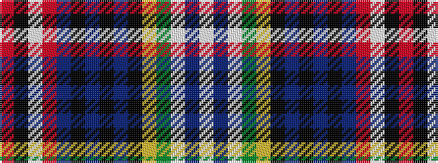

RKWRBKBKBKYGWBW

It is a 15 stripe tartan.

<figure class="pat-woven">

<figcaption>idealised sample</figcaption>
</figure>

## Colour Sequence



## Tartans with this colour sequence

| Tartans |
|---------------|
| [MacPherson Dress](/setts/s15/w13db3w13dg10ly2k7db5k2db2k2db5r8w2k2r2~x2/)|
||
| [MacPherson, dress](/setts/s15/w13db3w13g10ly2k7db5k2db2k2db5r8w2k2r2~x2/)|
||
