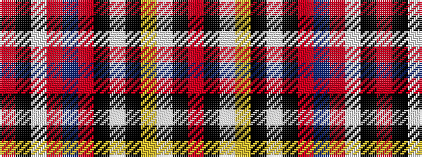

RKWRBRKWKYWKR

It is a 13 stripe tartan.

<figure class="pat-woven">

<figcaption>idealised sample</figcaption>
</figure>

## Colour Sequence



## Tartans with this colour sequence

| Tartans |
|---------------|
| [K9](/setts/s13/r40k2w1lo40k3w2k3r5db22r3w1k3r7~x2/)|
||
