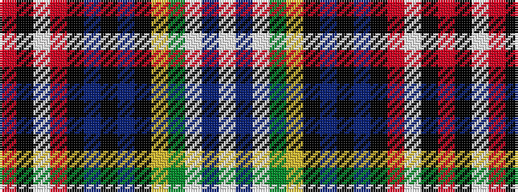

RKWRKBKBKYGWBW

It is a 14 stripe tartan.

<figure class="pat-woven">

<figcaption>idealised sample</figcaption>
</figure>

## Colour Sequence



## Tartans with this colour sequence

| Tartans |
|---------------|
| [MacInnes Hunting Dress Clan Tartan Tartan Number: 1614. Earliest known date: pre 2003 Could also be Dress Red MacPherson See products available Copyright © Blair Urquhart, Comrie, 2015](/setts/s14/w8db3w10dy8ly2k4db3k2db3k2r3w1k2r2~x2/)|
||
