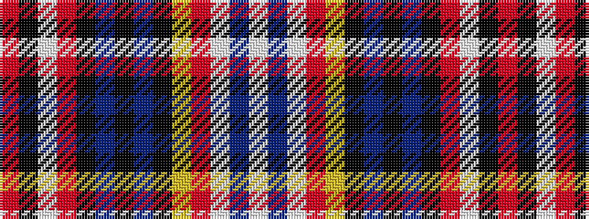

RKWRKBKBKYRWBW

It is a 14 stripe tartan.

<figure class="pat-woven">

<figcaption>idealised sample</figcaption>
</figure>

## Colour Sequence



## Tartans with this colour sequence

| Tartans |
|---------------|
| [MacInnes Ancient Hunting](/variants/s14/w8db3w10o8ly2k4db3k2db3k2r3w1k2r2~x2/)|
||
