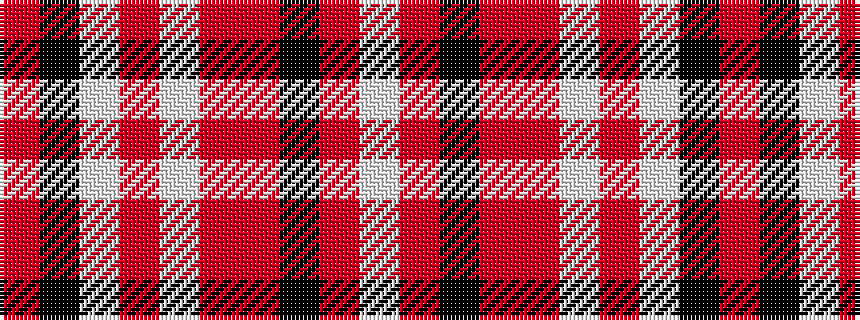

RKWRWRRKRW

It is a 10 stripe tartan.

<figure class="pat-woven">

<figcaption>idealised sample</figcaption>
</figure>

## Colour Sequence



## Tartans with this colour sequence

| Tartans |
|---------------|
| [President High School](/variants/s10/o32k5w3o3w3o7r5k1r17w3~x2/)|
||
