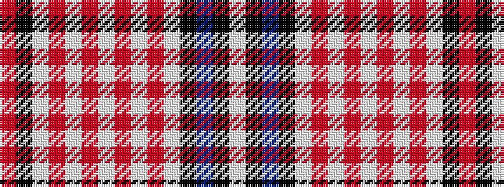

RKWRWRWRWRWKBKW

It is a 15 stripe tartan.

<figure class="pat-woven">

<figcaption>idealised sample</figcaption>
</figure>

## Colour Sequence



## Tartans with this colour sequence

| Tartans |
|---------------|
| [Japanese (nihon)](/variants/s15/r48k1w8r2w1r2w8r2w1r2w8k1db16k1w4~x2/)|
||
