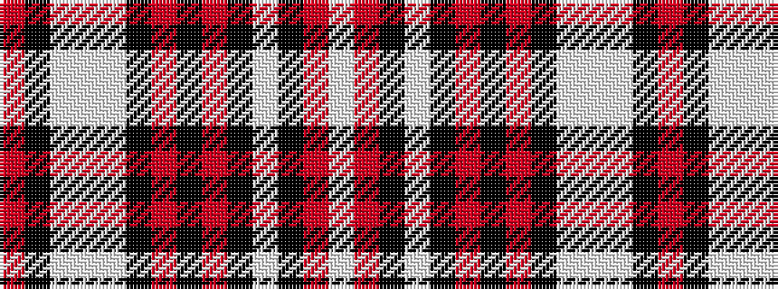

RKWWWKRKRKWKRW

It is a 14 stripe tartan.

<figure class="pat-woven">

<figcaption>idealised sample</figcaption>
</figure>

## Colour Sequence



## Tartans with this colour sequence

| Tartans |
|---------------|
| [Alabama, University of](/variants/s14/r32k2wi3w4wi3k2r22k1r5k2w6k2r4w5~x2/)|
||
