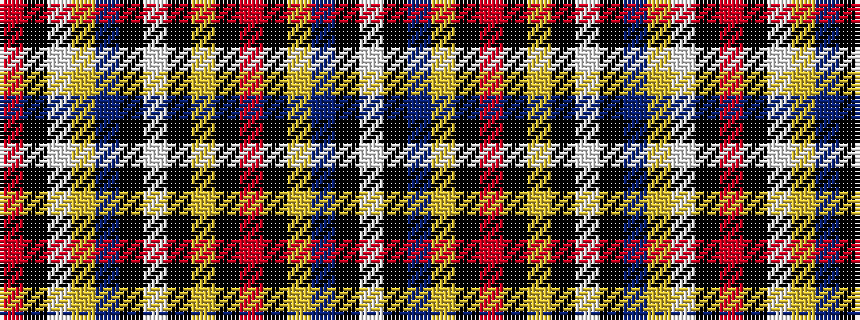

RKWYBKWKYKRKYBKW

It is a 16 stripe tartan.

<figure class="pat-woven">

<figcaption>idealised sample</figcaption>
</figure>

## Colour Sequence



## Tartans with this colour sequence

| Tartans |
|---------------|
| [Borders (Personal)](/variants/s16/w2k15n7lri7k1r1k1lr7k1w7k7n7lri7w1k1r1~x2/)|
||
