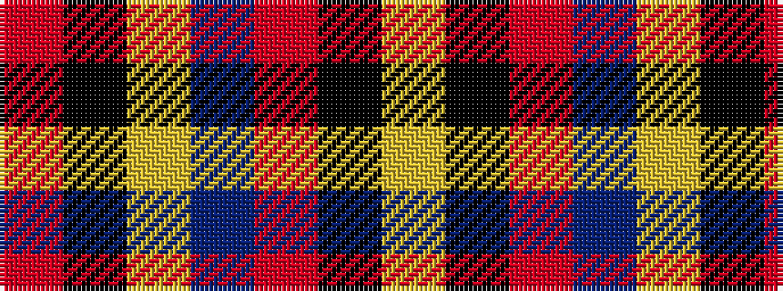

RKYBRKY

It is a 7 stripe tartan.

<figure class="pat-woven">

<figcaption>idealised sample</figcaption>
</figure>

## Colour Sequence



## Tartans with this colour sequence

| Tartans |
|---------------|
| [Scrymgeour](/variants/s7/r46k3ly6db8r6k3ly46/)|
||
| [Scrymgeour](/setts/r15k1ly2db3r2k1ly15/)|
||
| [Scrymgeour Family Tartan](/variants/s7/o15k1ly2db3o2k1ly15~x4/)|
||
