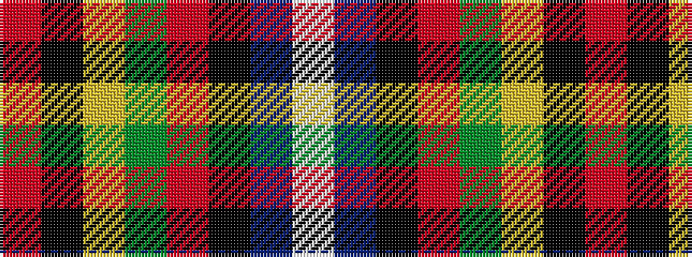

RKYGRKBW

It is a 8 stripe tartan.

<figure class="pat-woven">

<figcaption>idealised sample</figcaption>
</figure>

## Colour Sequence



## Tartans with this colour sequence

| Tartans |
|---------------|
| [MacIngust](/variants/s8/r70k2ly1dg18r10k4t4w1~x2/)|
||
