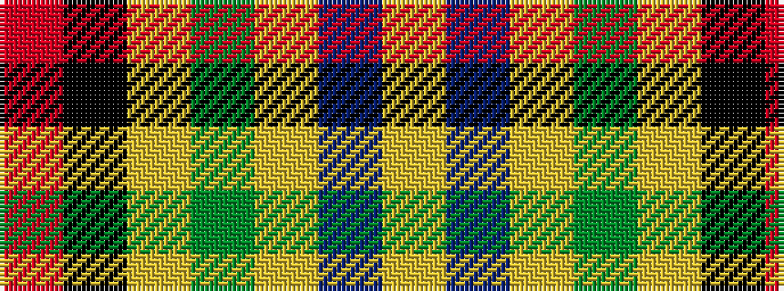

RKYGYBY

It is a 7 stripe tartan.

<figure class="pat-woven">

<figcaption>idealised sample</figcaption>
</figure>

## Colour Sequence



## Tartans with this colour sequence

| Tartans |
|---------------|
| [James (Personal)](/setts/s7/r2k6ly1dg12ly1db6lr2~x4/)|
||
