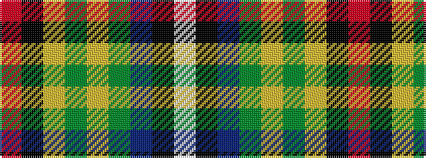

RKYGYGBKW

It is a 9 stripe tartan.

<figure class="pat-woven">

<figcaption>idealised sample</figcaption>
</figure>

## Colour Sequence



## Tartans with this colour sequence

| Tartans |
|---------------|
| [Federated Women's Institutes of](/setts/s9/r2k1lo2g3lo4g3db12k1lb2~x4/)|
||
