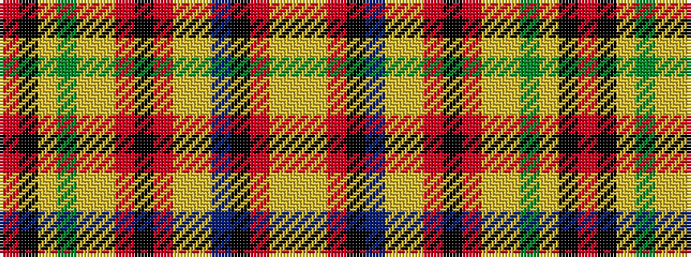

RKYGYYRKRYYBKRYY

It is a 16 stripe tartan.

<figure class="pat-woven">

<figcaption>idealised sample</figcaption>
</figure>

## Colour Sequence



## Tartans with this colour sequence

| Tartans |
|---------------|
| [Clan Chattan](/setts/s16/r122k4lr2dg32lr4ly7r7k2r7ly7lr4b32k8r8ly12lr4~x2/)|
||
| [Clan Chattan](/setts/s16/r122k4lr2dg32lr4ly7r7k2r7ly7lr4b32k8r8ly12lr4/)|
||
| [Clan Chattan D](/setts/s16/r60k2lr1dg16lr2ly3r3k1r3ly3lr2b16k4r4ly6lr2~x2/)|
||
| [Clan Chattan D](/setts/s16/r60k2lr1dg16lr2ly3r3k1r3ly3lr2b16k4r4ly6lr2/)|
||
