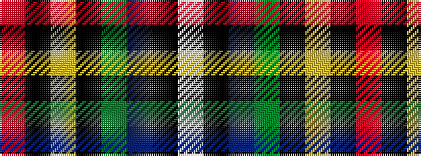

RKYKGBKW

It is a 8 stripe tartan.

<figure class="pat-woven">

<figcaption>idealised sample</figcaption>
</figure>

## Colour Sequence



## Tartans with this colour sequence

| Tartans |
|---------------|
| [Hislop hunting](/setts/s8/r2k8ly1k8g8db8k2w2~x2/)|
||
