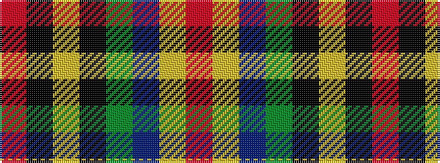

RKYKGBYR

It is a 8 stripe tartan.

<figure class="pat-woven">

<figcaption>idealised sample</figcaption>
</figure>

## Colour Sequence



## Tartans with this colour sequence

| Tartans |
|---------------|
| [Sey (Name)](/setts/s8/r2k8ly1k8g13db13lo1r2~x2/)|
||
