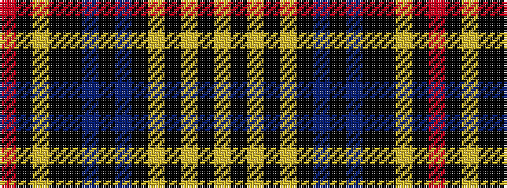

RKYKKBKBKYKYKY

It is a 14 stripe tartan.

<figure class="pat-woven">

<figcaption>idealised sample</figcaption>
</figure>

## Colour Sequence



## Tartans with this colour sequence

| Tartans |
|---------------|
| [(5) Ruxton](/setts/s14/r21k3lo1k3k2db1k3db8k29lo4k2lo1k7lo3~x2/)|
||
