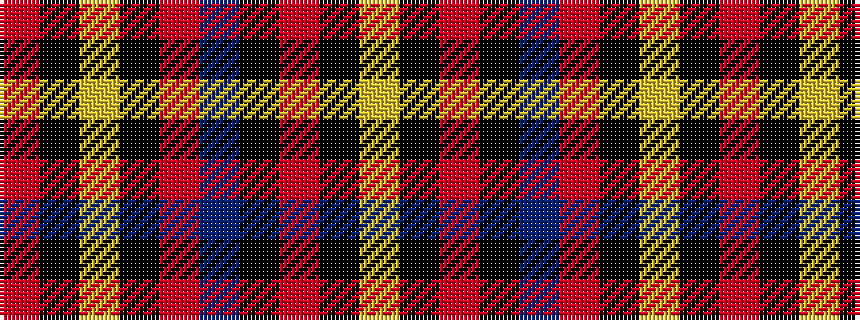

RKYKRBKRKY

It is a 10 stripe tartan.

<figure class="pat-woven">

<figcaption>idealised sample</figcaption>
</figure>

## Colour Sequence



## Tartans with this colour sequence

| Tartans |
|---------------|
| [Braemar, Castle](/variants/s10/r52k5ly5k8o5dr5k2r6k1ly2~x2/)|
||
