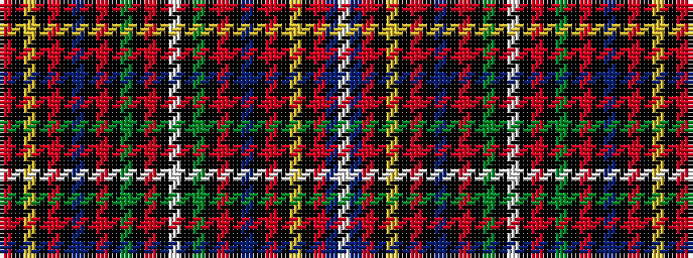

RKYKRKBKRKGKRKWKGKRKBKRKYKRBW

It is a 29 stripe tartan.

<figure class="pat-woven">

<figcaption>idealised sample</figcaption>
</figure>

## Colour Sequence



## Tartans with this colour sequence

| Tartans |
|---------------|
| [Women's Wear Daily 'Clan' (Fashion)](/variants/s29/r1k1ly2k1r1k1b2k1r1k1g2k1r2k1w12k1g2k1r1k1b2k1r1k1ly2k1r1dt28w1~x2/)|
||
