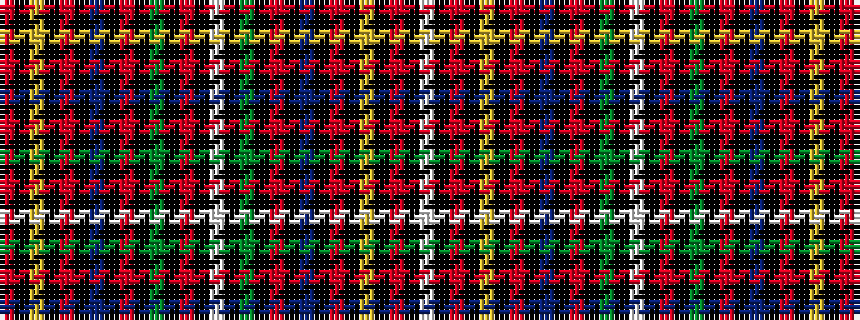

RKYKRKBKRKGKRKWKGKRKBKRKYKRKW

It is a 29 stripe tartan.

<figure class="pat-woven">

<figcaption>idealised sample</figcaption>
</figure>

## Colour Sequence



## Tartans with this colour sequence

| Tartans |
|---------------|
| [Women's Wear Daily Hunting (Fashion)](/variants/s29/r1ki1ly2ki1r1ki1b2ki1r1ki1g2ki1r2ki1w12ki1g2ki1r1ki1b2ki1r1ki1ly2ki1r1k28w1~x2/)|
||
