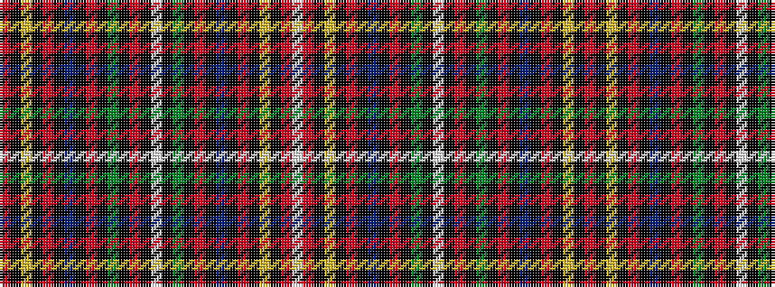

RKYKRKBKRKGKRKWKGKRKBKRKYKRW

It is a 28 stripe tartan.

<figure class="pat-woven">

<figcaption>idealised sample</figcaption>
</figure>

## Colour Sequence



## Tartans with this colour sequence

| Tartans |
|---------------|
| [Women's Wear Daily Dress (Fashion)](/setts/s28/r1k1ly2k1r1k1b2k1r1k1g2k1r2k1w12k1g2k1r1k1b2k1r1k1ly2k1r30w1~x2/)|
||
