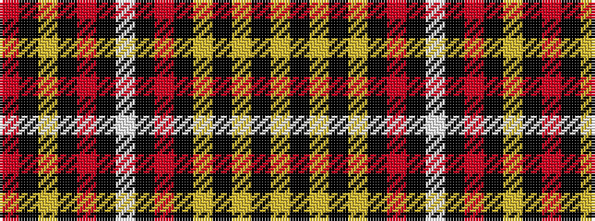

RKYKRKWKRKYKYKY

It is a 15 stripe tartan.

<figure class="pat-woven">

<figcaption>idealised sample</figcaption>
</figure>

## Colour Sequence



## Tartans with this colour sequence

| Tartans |
|---------------|
| [MacKenzie Hunting (Brown)](/setts/s15/lo12k2lo2k2lo2k12o12k1w2k1o12k12lo12k1r2~x2/)|
||
