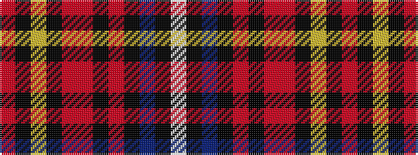

RKYKRRKRKBKW

It is a 12 stripe tartan.

<figure class="pat-woven">

<figcaption>idealised sample</figcaption>
</figure>

## Colour Sequence



## Tartans with this colour sequence

| Tartans |
|---------------|
| [German American](/setts/s12/r4k4lo3k4r54r5k54r4k3db9k2w4/)|
||
