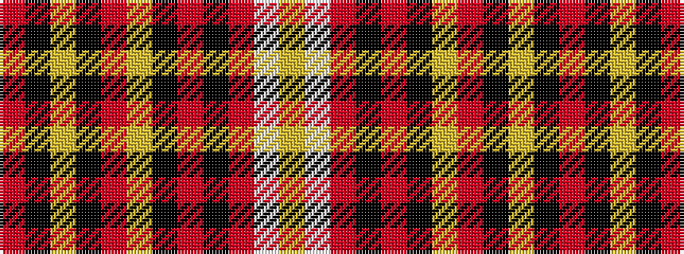

RKYKRYKRKRWY

It is a 12 stripe tartan.

<figure class="pat-woven">

<figcaption>idealised sample</figcaption>
</figure>

## Colour Sequence



## Tartans with this colour sequence

| Tartans |
|---------------|
| [Cates Dress (Clan)](/setts/s12/ly2w1r2k20r9k20ly7o20k5ly1k1r1~x2/)|
||
