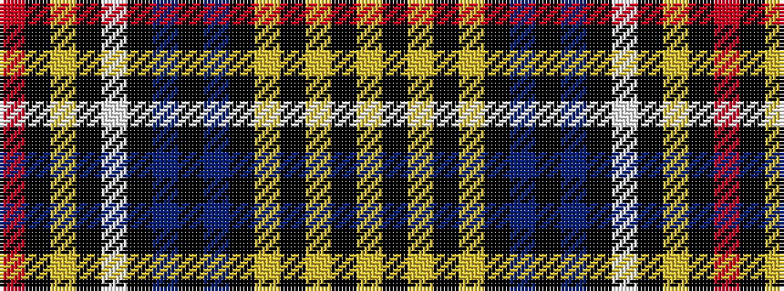

RKYKWKBKBKYKYKY

It is a 15 stripe tartan.

<figure class="pat-woven">

<figcaption>idealised sample</figcaption>
</figure>

## Colour Sequence



## Tartans with this colour sequence

| Tartans |
|---------------|
| [Ruxton](/setts/s15/m21k3ly1k1w3k3db1k3db8k19ly4k2ly1k7ly3~x2/)|
||
| [Ruxton](/setts/s15/r22k3lo1k1w3k3db1k3db8k19lo4k2lo1k7lo3~x2/)|
||
