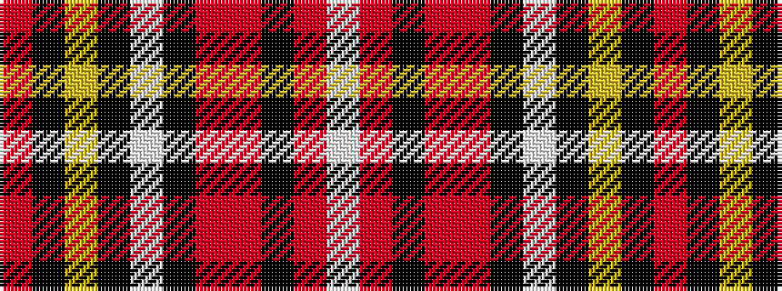

RKYKWKRRKRW

It is a 11 stripe tartan.

<figure class="pat-woven">

<figcaption>idealised sample</figcaption>
</figure>

## Colour Sequence



## Tartans with this colour sequence

| Tartans |
|---------------|
| [Cavalier Green.. Trade Tartan](/variants/s11/o45k10ly2k2w2k2r10o5k1o5w1~x2/)|
||
