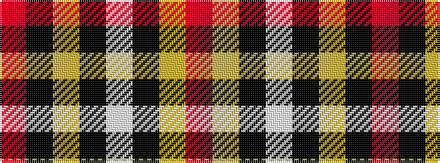

RKYKWKYR

It is a 8 stripe tartan.

<figure class="pat-woven">

<figcaption>idealised sample</figcaption>
</figure>

## Colour Sequence



## Tartans with this colour sequence

| Tartans |
|---------------|
| [FIRES Center of Excelence](/setts/s8/r50ly8k2w2k2ly8k22r3~x2/)|
||
