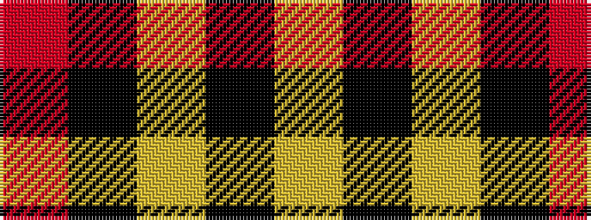

RKYKY

It is a 5 stripe tartan.

<figure class="pat-woven">

<figcaption>idealised sample</figcaption>
</figure>

## Colour Sequence



## Tartans with this colour sequence

| Tartans |
|---------------|
| [Burberry Blue](/setts/s5/lr3k3lr3k10r1~x6/)|
||
| [Gwynn (Name)](/setts/s5/ly9k4ly4k45r4~x2/)|
||
| [Welsh National #3](/setts/s5/ly7k4ly4k39r4~x2/)|
||
