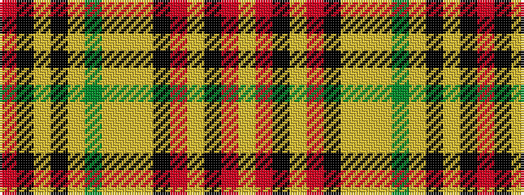

RKYKYGYYYKRYKRY

It is a 15 stripe tartan.

<figure class="pat-woven">

<figcaption>idealised sample</figcaption>
</figure>

## Colour Sequence



## Tartans with this colour sequence

| Tartans |
|---------------|
| [Purdy, R Scott (Personal)](/setts/s15/r1k1lyi1k1ly6g3ly7lyi1ly12k1r21lyi1k1r1ly1~x2/)|
||
