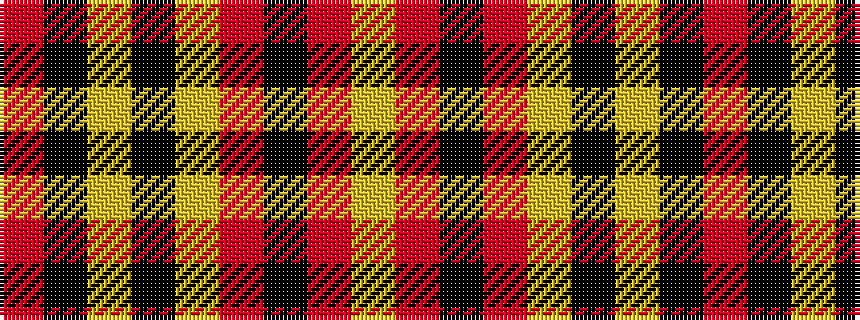

RKYKYRKRY

It is a 9 stripe tartan.

<figure class="pat-woven">

<figcaption>idealised sample</figcaption>
</figure>

## Colour Sequence



## Tartans with this colour sequence

| Tartans |
|---------------|
| [Anthony Plaid Red](/setts/s9/r18k1ly3k1lr1r3k2r2lr2~x4/)|
||
