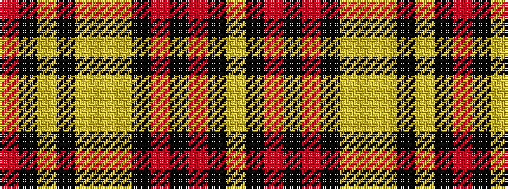

RKYKYYYKRKRKY

It is a 13 stripe tartan.

<figure class="pat-woven">

<figcaption>idealised sample</figcaption>
</figure>

## Colour Sequence



## Tartans with this colour sequence

| Tartans |
|---------------|
| [92nd Regiment Drummers' Plaid (Mil.)](/setts/s13/lr12k2r2k2r2k12lg11ly2lg11k12lr11k2r2~x2/)|
||
