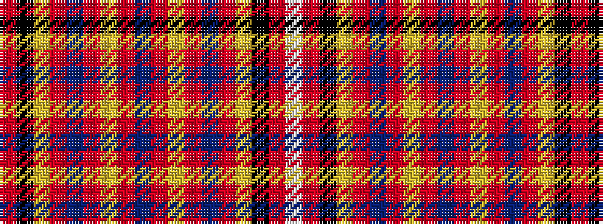

RKYRBRYRBRYRBRYKRW

It is a 18 stripe tartan.

<figure class="pat-woven">

<figcaption>idealised sample</figcaption>
</figure>

## Colour Sequence



## Tartans with this colour sequence

| Tartans |
|---------------|
| [Selkirk High School](/variants/s18/m18k18ly1r2b2r2ly1m18b2m18ly1r2b2r2ly1k18m18w3~x2/)|
||
