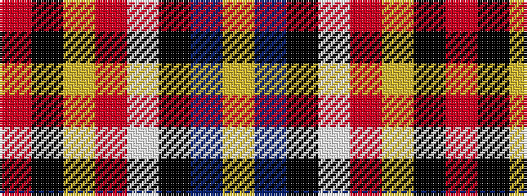

RKYRWKBY

It is a 8 stripe tartan.

<figure class="pat-woven">

<figcaption>idealised sample</figcaption>
</figure>

## Colour Sequence



## Tartans with this colour sequence

| Tartans |
|---------------|
| [Conroy](/variants/s8/r64k10ly4ri5w2k2db3ly4~x2/)|
||
| [Conroy (Personal)](/variants/s8/r64k10lo4m5lb2k2db3lo4~x2/)|
||
| [Conroy Family Tartan](/variants/s8/r64k10ly4m5w2k2db3ly4~x2/)|
||
