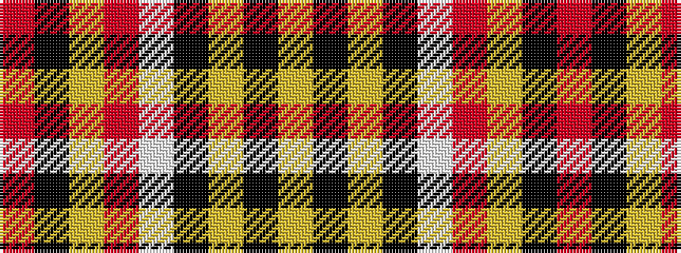

RKYRWKYKY

It is a 9 stripe tartan.

<figure class="pat-woven">

<figcaption>idealised sample</figcaption>
</figure>

## Colour Sequence



## Tartans with this colour sequence

| Tartans |
|---------------|
| [MacAlister of Skye (Clan?)](/setts/s9/r4k5lo1r26lb1k30lo1k1lo4~x2/)|
||
