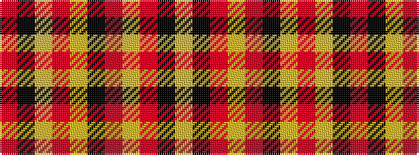

RKYRYKRYRKY

It is a 11 stripe tartan.

<figure class="pat-woven">

<figcaption>idealised sample</figcaption>
</figure>

## Colour Sequence



## Tartans with this colour sequence

| Tartans |
|---------------|
| [State Seal of Rhode Island (Fash.)](/setts/s11/o2k1lo14o6lo2k10o2lo6o28k1lo2~x2/)|
||
