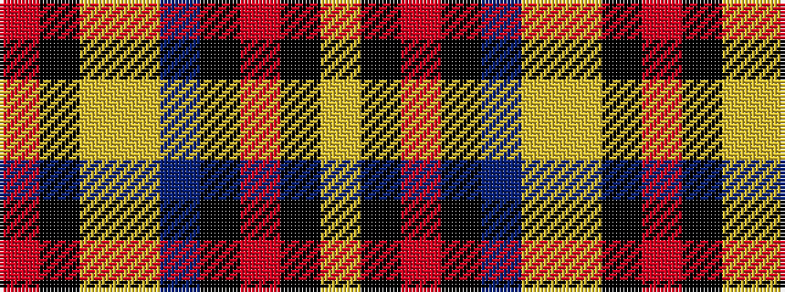

RKYYBKRKY

It is a 9 stripe tartan.

<figure class="pat-woven">

<figcaption>idealised sample</figcaption>
</figure>

## Colour Sequence



## Tartans with this colour sequence

| Tartans |
|---------------|
| [Braemar Castle](/variants/s9/r52k5ly5lo5do5k2r6k1ly2~x2/)|
||
