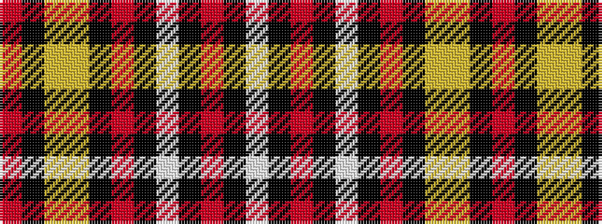

RKYYKRKWKRKW

It is a 12 stripe tartan.

<figure class="pat-woven">

<figcaption>idealised sample</figcaption>
</figure>

## Colour Sequence



## Tartans with this colour sequence

| Tartans |
|---------------|
| [Tyrone County Crest (Fashion)](/setts/s12/r4k2ly13lo3k22r2k2w13k7r3k7w4~x2/)|
||
