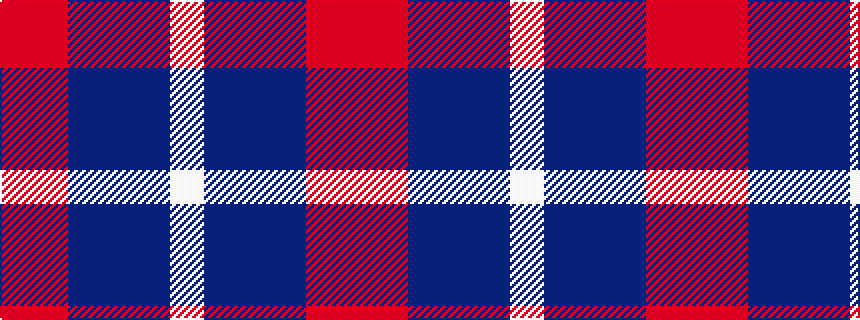

RRBBBW

It is a 6 stripe tartan.

<figure class="pat-woven">

<figcaption>idealised sample</figcaption>
</figure>

## Colour Sequence



## Tartans with this colour sequence

| Tartans |
|---------------|
| [Afternoon Tea / Assam](/setts/s6/ri15r98dp72t25dp8w15/)|
||
| [Afternoon Tea / Assam](/setts/s6/r15ri98db72t25db8w15/)|
||
