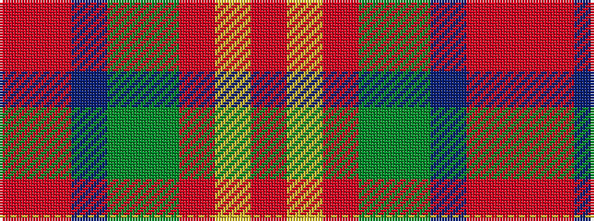

RRBGGRYR

It is a 8 stripe tartan.

<figure class="pat-woven">

<figcaption>idealised sample</figcaption>
</figure>

## Colour Sequence



## Tartans with this colour sequence

| Tartans |
|---------------|
| [Unidentified 2](/setts/s8/o13ly3o13g23dy16dr13o23r5~x2/)|
||
