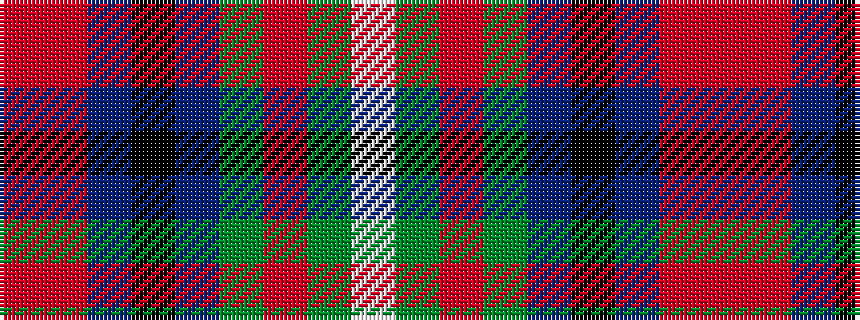

RRBKBGRGW

It is a 9 stripe tartan.

<figure class="pat-woven">

<figcaption>idealised sample</figcaption>
</figure>

## Colour Sequence



## Tartans with this colour sequence

| Tartans |
|---------------|
| [Chinzei Keiai School](/setts/s9/r3m3dt16k2dt2g16r3g2w2~x2/)|
||
