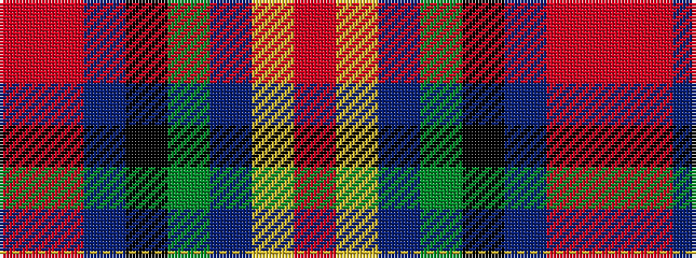

RRBKGBYR

It is a 8 stripe tartan.

<figure class="pat-woven">

<figcaption>idealised sample</figcaption>
</figure>

## Colour Sequence



## Tartans with this colour sequence

| Tartans |
|---------------|
| [State Seal of West Virginia (Fash)](/variants/s8/o49lo3b13dy8k23b10o14r4~x2/)|
||
