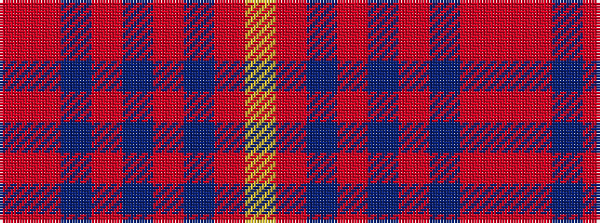

RRBRBRBRY

It is a 9 stripe tartan.

<figure class="pat-woven">

<figcaption>idealised sample</figcaption>
</figure>

## Colour Sequence



## Tartans with this colour sequence

| Tartans |
|---------------|
| [MacIver of Strathendry Htg (Personal](/setts/s9/r3o28do5o5do33o5do5o28lo3~x2/)|
||
