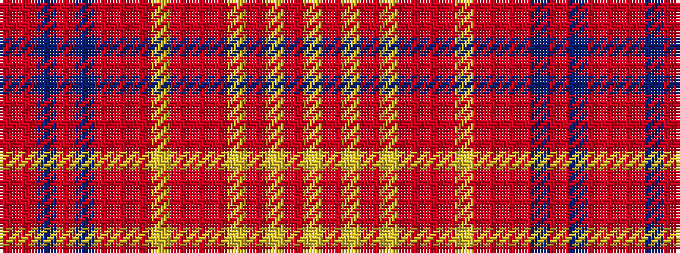

RRBRBRRRYRRRYRYRY

It is a 17 stripe tartan.

<figure class="pat-woven">

<figcaption>idealised sample</figcaption>
</figure>

## Colour Sequence



## Tartans with this colour sequence

| Tartans |
|---------------|
| [Thom, Calum (Personal)](/setts/s17/ly3r2ly9r1ly3r3m3r10ly2r10m3r3do6r2do6m2r2~x2/)|
||
