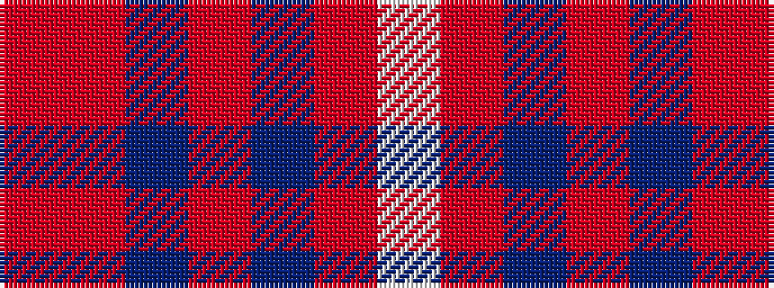

RRBRBRW

It is a 7 stripe tartan.

<figure class="pat-woven">

<figcaption>idealised sample</figcaption>
</figure>

## Colour Sequence



## Tartans with this colour sequence

| Tartans |
|---------------|
| [Reece, Mathew](/variants/s7/w2o44dt8o2dt2o3r1~x2/)|
||
