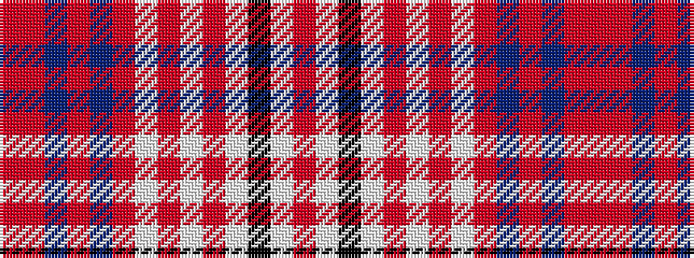

RRBRBRWRWRWKWR

It is a 14 stripe tartan.

<figure class="pat-woven">

<figcaption>idealised sample</figcaption>
</figure>

## Colour Sequence



## Tartans with this colour sequence

| Tartans |
|---------------|
| [Harrods](/variants/s14/r2oi3dr9o2dr5o4w1oi1w1oi1w12k2w2oi2~x2/)|
||
