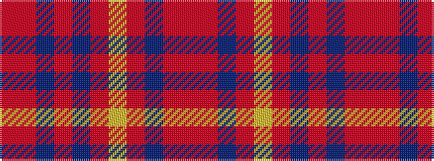

RRBRBRYRBRR

It is a 11 stripe tartan.

<figure class="pat-woven">

<figcaption>idealised sample</figcaption>
</figure>

## Colour Sequence



## Tartans with this colour sequence

| Tartans |
|---------------|
| [Morgan (Welsh Name)](/setts/s11/r4r34do20r4do8r6ly2r5do2r3r4/)|
||
