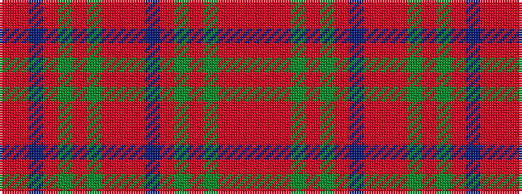

RRBRGRGRRRBRGRGRRR

It is a 18 stripe tartan.

<figure class="pat-woven">

<figcaption>idealised sample</figcaption>
</figure>

## Colour Sequence



## Tartans with this colour sequence

This pattern is a design lineage: every tartan below shares one colour order, whatever its owner —
near-identical designs are grouped, the largest lineage first (#112: the pattern is a tartan's
second parent, beside its family or clan).

<table class="sett-table">
<tbody>
<tr><td><a href="/variants/s18/r12ri2r2dg2r4dg2r4dp12ri6r2ri6dg12r12dg12r2dp1r36ri4~x2~r2109032-ri2307033/">MacCoul</a></td></tr>
<tr><td class="sett-swatch"></td></tr>
<tr class="cluster-sep"><td></td></tr>
<tr><td><a href="/setts/ri12r2ri2g2ri4g2ri4db12r6ri2r6g12ri12g12ri2db1ri36r4/">MacCoul</a></td></tr>
<tr><td class="sett-swatch"></td></tr>
</tbody>
</table>

