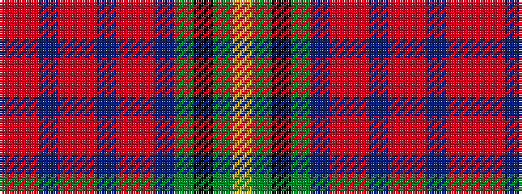

RRBRRBRRBGKGY

It is a 13 stripe tartan.

<figure class="pat-woven">

<figcaption>idealised sample</figcaption>
</figure>

## Colour Sequence



## Tartans with this colour sequence

| Tartans |
|---------------|
| [MacEochaidh (Personal)](/setts/s13/r5r1db1r3r1db2r5r4db4g3k3g3ly3~x4/)|
||
