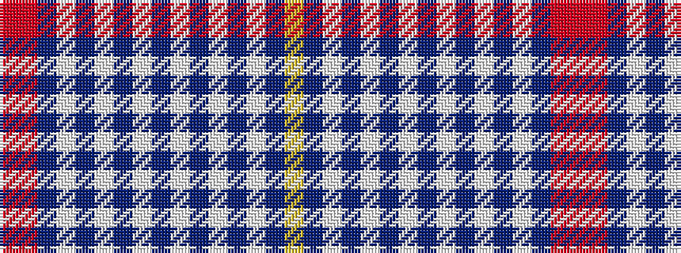

RRBWBWBWBWBWBWBY

It is a 16 stripe tartan.

<figure class="pat-woven">

<figcaption>idealised sample</figcaption>
</figure>

## Colour Sequence



## Tartans with this colour sequence

| Tartans |
|---------------|
| [Bradwell, Amy (Personal) XXXXXXXXXX](/setts/s16/r4o3dp2lb4dp2lb3dp4lb3dp6lb2dp8lb2dp6lb2t4lo3~x2/)|
||
