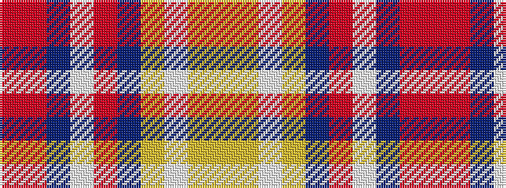

RRBWRBYWYY

It is a 10 stripe tartan.

<figure class="pat-woven">

<figcaption>idealised sample</figcaption>
</figure>

## Colour Sequence



## Tartans with this colour sequence

| Tartans |
|---------------|
| [Union Memorial Tartan (Military)](/variants/s10/ly12ly4lb4ly4db2r56lb18db1r4r3~x2/)|
||
