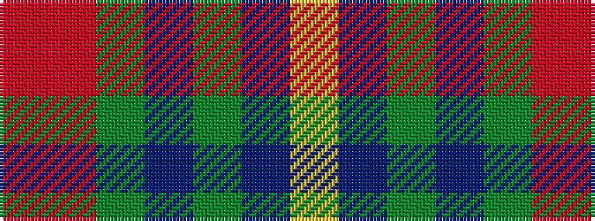

RRGBGBY

It is a 7 stripe tartan.

<figure class="pat-woven">

<figcaption>idealised sample</figcaption>
</figure>

## Colour Sequence



## Tartans with this colour sequence

| Tartans |
|---------------|
| [Wallace Memorial Centenary](/setts/s7/r1r12g1n9dy1t12lg1~x4/)|
||
